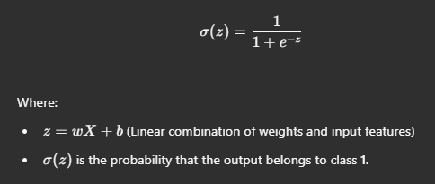
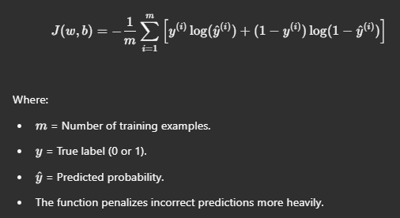
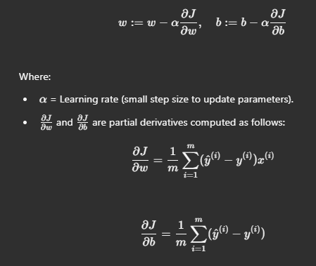
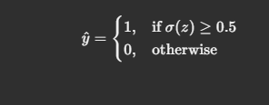

# Logistic Regression from Scratch

## 📌 Introduction
Logistic Regression is a fundamental algorithm used for binary classification problems. Unlike Linear Regression, which predicts continuous values, Logistic Regression predicts **probabilities** for classification tasks (e.g., Yes/No, Spam/Not Spam, 0/1).

In this project, we implement **Logistic Regression from scratch** using NumPy.

---

## 🔢 How Logistic Regression Works

### 1️⃣ **Hypothesis Function (Sigmoid Function)**
Logistic Regression uses the **sigmoid function** to map any real-valued number into a range between **0 and 1**.



### 2️⃣ **Cost Function (Binary Cross-Entropy Loss)**
Since Logistic Regression predicts probabilities, we use the **log loss** (binary cross-entropy) as our cost function:



### 3️⃣ **Gradient Descent Optimization**
To minimize the cost function, we use **gradient descent** to update the weights \( w \) and bias \( b \):



### 4️⃣ **Decision Rule**
After training, we use the model to make predictions:


This means if the probability of class **1** is at least **0.5**, we classify it as **1**, otherwise, it's **0**.

---

## 🚀 Implementation Steps
1. **Initialize Parameters:** Set initial weights \( w \) and bias \( b \) to small values (e.g., zero).
2. **Compute Predictions:** Use the sigmoid function to compute predicted probabilities.
3. **Compute Cost:** Calculate the loss using binary cross-entropy.
4. **Compute Gradients:** Derive gradients for updating weights and bias.
5. **Update Parameters:** Use gradient descent to optimize the weights.
6. **Repeat Until Convergence:** Iterate through steps 2–5 until the cost function minimizes.
7. **Make Predictions:** Convert probabilities into class labels (0 or 1) based on the decision rule.

---

## 🛠 Example Usage
```python
import numpy as np

# Sigmoid function
def sigmoid(z):
    return 1 / (1 + np.exp(-z))

# Cost function
def compute_cost(y, y_hat):
    m = len(y)
    return -(1/m) * np.sum(y * np.log(y_hat) + (1 - y) * np.log(1 - y_hat))

# Gradient descent update
def update_weights(X, y, w, b, learning_rate):
    m = X.shape[0]
    y_hat = sigmoid(np.dot(X, w) + b)
    dw = (1/m) * np.dot(X.T, (y_hat - y))
    db = (1/m) * np.sum(y_hat - y)
    w -= learning_rate * dw
    b -= learning_rate * db
    return w, b
```

---

## 📌 Why Implement Logistic Regression from Scratch?
✅ Helps understand **how machine learning models work internally**.  
✅ Builds strong foundations for more complex algorithms like **Neural Networks**.  
✅ Great for learning **gradient descent optimization**.  
✅ Useful for projects involving **binary classification** (e.g., Spam Detection, Disease Prediction, etc.).  

---

## 🤝 Contributing
Feel free to submit issues or pull requests to improve this project! 😊

---

## 📜 License
This project is open-source and available under the **MIT License**. Happy coding! 🚀

